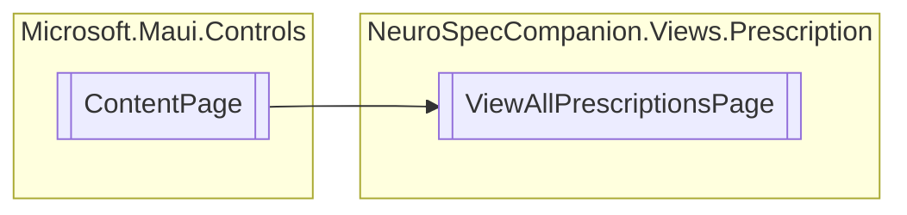

# ViewAllPrescriptionsPage `Public class`

## Diagram


## Details
### Inheritance
 - `ContentPage`

### Constructors
#### ViewAllPrescriptionsPage
[*Source code*](https://github.com///blob//NeuroSpecCompanion/Views/Prescription/ViewAllPrescriptionsPage.xaml.cs#L8)
```csharp
public ViewAllPrescriptionsPage()
```

*Generated with* [*ModularDoc*](https://github.com/hailstorm75/ModularDoc)
