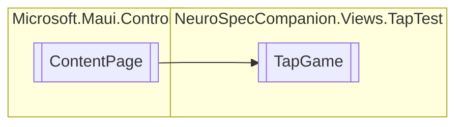

# TapGame `Public class`

## Diagram


## Details
### Inheritance
 - `ContentPage`

### Constructors
#### TapGame
[*Source code*](https://github.com///blob//NeuroSpecCompanion/Views/TapTest/TapGame.xaml.cs#L22)
```csharp
public TapGame()
```

*Generated with* [*ModularDoc*](https://github.com/hailstorm75/ModularDoc)
