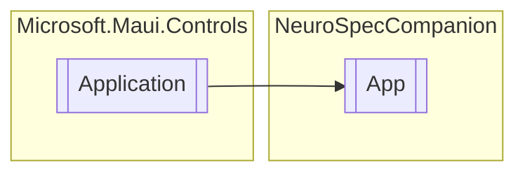

# App `Public class`

## Diagram


## Members
### Methods
#### Protected  methods
| Returns | Name |
| --- | --- |
| `void` | [`OnStart`](#onstart)() |

## Details
### Inheritance
 - `Application`

### Constructors
#### App
```csharp
public App()
```

### Methods
#### OnStart
```csharp
protected override async void OnStart()
```

*Generated with* [*ModularDoc*](https://github.com/hailstorm75/ModularDoc)
