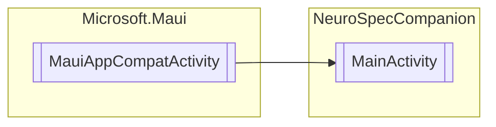

# MainActivity `Public class`

## Diagram


## Members
### Methods
#### Protected  methods
| Returns | Name |
| --- | --- |
| `void` | [`OnCreate`](#oncreate)(`Bundle` savedInstanceState) |

#### Public  methods
| Returns | Name |
| --- | --- |
| `void` | [`OnRequestPermissionsResult`](#onrequestpermissionsresult)(`int` requestCode, `string``[]` permissions, `Permission``[]` grantResults) |

## Details
### Inheritance
 - `MauiAppCompatActivity`

### Constructors
#### MainActivity
```csharp
public MainActivity()
```

### Methods
#### OnCreate
```csharp
protected override void OnCreate(Bundle savedInstanceState)
```
##### Arguments
| Type | Name | Description |
| --- | --- | --- |
| `Bundle` | savedInstanceState |   |

#### OnRequestPermissionsResult
```csharp
public override void OnRequestPermissionsResult(int requestCode, string[] permissions, Permission[] grantResults)
```
##### Arguments
| Type | Name | Description |
| --- | --- | --- |
| `int` | requestCode |   |
| `string``[]` | permissions |   |
| `Permission``[]` | grantResults |   |

*Generated with* [*ModularDoc*](https://github.com/hailstorm75/ModularDoc)
