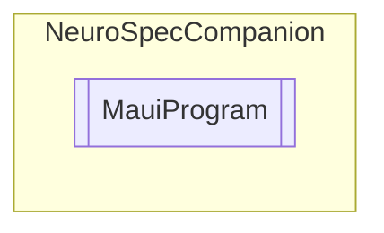

# MauiProgram `Public class`

## Diagram


## Members
### Methods
#### Public Static methods
| Returns | Name |
| --- | --- |
| `MauiApp` | [`CreateMauiApp`](#createmauiapp)() |

## Details
### Methods
#### CreateMauiApp
```csharp
public static MauiApp CreateMauiApp()
```

*Generated with* [*ModularDoc*](https://github.com/hailstorm75/ModularDoc)
