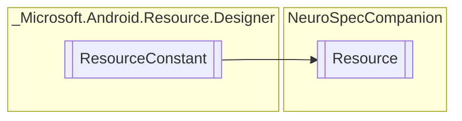

# Resource `Public class`

## Diagram


## Details
### Inheritance
 - `ResourceConstant`

### Constructors
#### Resource
```csharp
public Resource()
```

*Generated with* [*ModularDoc*](https://github.com/hailstorm75/ModularDoc)
