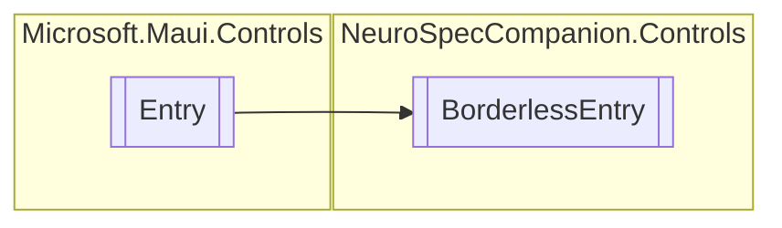

# BorderlessEntry `Public class`

## Diagram


## Details
### Inheritance
 - `Entry`

### Constructors
#### BorderlessEntry
```csharp
public BorderlessEntry()
```

*Generated with* [*ModularDoc*](https://github.com/hailstorm75/ModularDoc)
