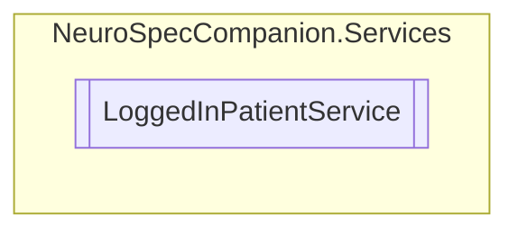

# LoggedInPatientService `Public class`

## Diagram


## Members
### Properties
#### Public Static properties
| Type | Name | Methods |
| --- | --- | --- |
| [`Patient`](./neurospecsharedmodelsdto-Patient) | [`LoggedInPatient`](#loggedinpatient) | `get, set` |

## Details
### Properties
#### LoggedInPatient
```csharp
public static Patient LoggedInPatient { get; set; }
```

*Generated with* [*ModularDoc*](https://github.com/hailstorm75/ModularDoc)
