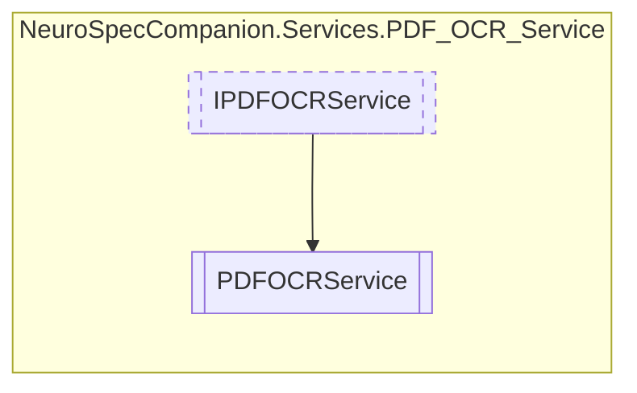

# PDFOCRService `Public class`

## Diagram


## Members
### Methods
#### Public  methods
| Returns | Name |
| --- | --- |
| `Task`&lt;`string`&gt; | [`ReadTextFromPDFAsync`](#readtextfrompdfasync)(`Stream` pdfStream) |

## Details
### Inheritance
 - [
`IPDFOCRService`
](./neurospeccompanionservicespdf_ocr_service-IPDFOCRService)

### Constructors
#### PDFOCRService
```csharp
public PDFOCRService()
```

### Methods
#### ReadTextFromPDFAsync
```csharp
public virtual async Task<string> ReadTextFromPDFAsync(Stream pdfStream)
```
##### Arguments
| Type | Name | Description |
| --- | --- | --- |
| `Stream` | pdfStream |   |

*Generated with* [*ModularDoc*](https://github.com/hailstorm75/ModularDoc)
