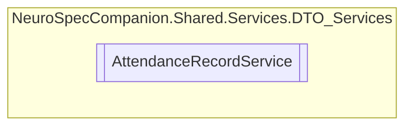

# AttendanceRecordService `Public class`

## Diagram


## Members
### Methods
#### Public  methods
| Returns | Name |
| --- | --- |
| `Task` | [`DeleteAttendanceRecordAsync`](#deleteattendancerecordasync)(`int` recordID) |
| `Task`&lt;`List`&lt;[`AttendanceRecord`](./neurospecsharedmodelsdto-AttendanceRecord)&gt;&gt; | [`GetAllAttendanceRecordsAsync`](#getallattendancerecordsasync)() |
| `Task`&lt;[`AttendanceRecord`](./neurospecsharedmodelsdto-AttendanceRecord)&gt; | [`GetAttendanceRecordByIDAsync`](#getattendancerecordbyidasync)(`int` recordID) |
| `Task`&lt;`List`&lt;[`AttendanceRecord`](./neurospecsharedmodelsdto-AttendanceRecord)&gt;&gt; | [`GetAttendanceRecordsByDateAsync`](#getattendancerecordsbydateasync)(`DateTime` date) |
| `Task`&lt;`List`&lt;[`AttendanceRecord`](./neurospecsharedmodelsdto-AttendanceRecord)&gt;&gt; | [`GetUserAttendanceRecordsAsync`](#getuserattendancerecordsasync)(`int` userID) |
| `Task`&lt;[`AttendanceRecord`](./neurospecsharedmodelsdto-AttendanceRecord)&gt; | [`InsertAttendanceRecordAsync`](#insertattendancerecordasync)([`AttendanceRecord`](./neurospecsharedmodelsdto-AttendanceRecord) attendanceRecord) |
| `Task` | [`UpdateAttendanceRecordAsync`](#updateattendancerecordasync)(`int` recordID, [`AttendanceRecord`](./neurospecsharedmodelsdto-AttendanceRecord) attendanceRecord) |

## Details
### Constructors
#### AttendanceRecordService
```csharp
public AttendanceRecordService()
```

### Methods
#### GetAllAttendanceRecordsAsync
```csharp
public async Task<List<AttendanceRecord>> GetAllAttendanceRecordsAsync()
```

#### GetAttendanceRecordByIDAsync
```csharp
public async Task<AttendanceRecord> GetAttendanceRecordByIDAsync(int recordID)
```
##### Arguments
| Type | Name | Description |
| --- | --- | --- |
| `int` | recordID |   |

#### GetAttendanceRecordsByDateAsync
```csharp
public async Task<List<AttendanceRecord>> GetAttendanceRecordsByDateAsync(DateTime date)
```
##### Arguments
| Type | Name | Description |
| --- | --- | --- |
| `DateTime` | date |   |

#### GetUserAttendanceRecordsAsync
```csharp
public async Task<List<AttendanceRecord>> GetUserAttendanceRecordsAsync(int userID)
```
##### Arguments
| Type | Name | Description |
| --- | --- | --- |
| `int` | userID |   |

#### InsertAttendanceRecordAsync
```csharp
public async Task<AttendanceRecord> InsertAttendanceRecordAsync(AttendanceRecord attendanceRecord)
```
##### Arguments
| Type | Name | Description |
| --- | --- | --- |
| [`AttendanceRecord`](./neurospecsharedmodelsdto-AttendanceRecord) | attendanceRecord |   |

#### UpdateAttendanceRecordAsync
```csharp
public async Task UpdateAttendanceRecordAsync(int recordID, AttendanceRecord attendanceRecord)
```
##### Arguments
| Type | Name | Description |
| --- | --- | --- |
| `int` | recordID |   |
| [`AttendanceRecord`](./neurospecsharedmodelsdto-AttendanceRecord) | attendanceRecord |   |

#### DeleteAttendanceRecordAsync
```csharp
public async Task DeleteAttendanceRecordAsync(int recordID)
```
##### Arguments
| Type | Name | Description |
| --- | --- | --- |
| `int` | recordID |   |

*Generated with* [*ModularDoc*](https://github.com/hailstorm75/ModularDoc)
