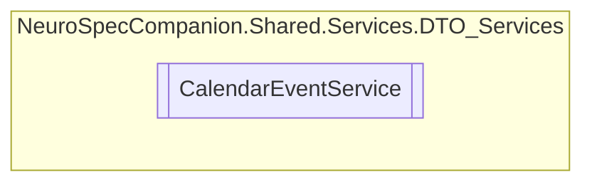

# CalendarEventService `Public class`

## Diagram


## Members
### Methods
#### Public  methods
| Returns | Name |
| --- | --- |
| `Task` | [`DeleteCalendarEventAsync`](#deletecalendareventasync)(`int` eventID) |
| `Task`&lt;`List`&lt;[`CalendarEvent`](./neurospecsharedmodelsdto-CalendarEvent)&gt;&gt; | [`GetAllCalendarEventsAsync`](#getallcalendareventsasync)() |
| `Task`&lt;[`CalendarEvent`](./neurospecsharedmodelsdto-CalendarEvent)&gt; | [`GetCalendarEventByIDAsync`](#getcalendareventbyidasync)(`int` eventID) |
| `Task`&lt;`List`&lt;[`CalendarEvent`](./neurospecsharedmodelsdto-CalendarEvent)&gt;&gt; | [`GetCalendarEventsByUserIDAndDateAsync`](#getcalendareventsbyuseridanddateasync)(`int` userID, `DateTime` dateTime) |
| `Task`&lt;[`CalendarEvent`](./neurospecsharedmodelsdto-CalendarEvent)&gt; | [`InsertCalendarEventAsync`](#insertcalendareventasync)([`CalendarEvent`](./neurospecsharedmodelsdto-CalendarEvent) calendarEvent) |
| `Task` | [`UpdateCalendarEventAsync`](#updatecalendareventasync)(`int` eventID, [`CalendarEvent`](./neurospecsharedmodelsdto-CalendarEvent) calendarEvent) |

## Details
### Constructors
#### CalendarEventService
```csharp
public CalendarEventService()
```

### Methods
#### GetAllCalendarEventsAsync
```csharp
public async Task<List<CalendarEvent>> GetAllCalendarEventsAsync()
```

#### GetCalendarEventByIDAsync
```csharp
public async Task<CalendarEvent> GetCalendarEventByIDAsync(int eventID)
```
##### Arguments
| Type | Name | Description |
| --- | --- | --- |
| `int` | eventID |   |

#### InsertCalendarEventAsync
```csharp
public async Task<CalendarEvent> InsertCalendarEventAsync(CalendarEvent calendarEvent)
```
##### Arguments
| Type | Name | Description |
| --- | --- | --- |
| [`CalendarEvent`](./neurospecsharedmodelsdto-CalendarEvent) | calendarEvent |   |

#### UpdateCalendarEventAsync
```csharp
public async Task UpdateCalendarEventAsync(int eventID, CalendarEvent calendarEvent)
```
##### Arguments
| Type | Name | Description |
| --- | --- | --- |
| `int` | eventID |   |
| [`CalendarEvent`](./neurospecsharedmodelsdto-CalendarEvent) | calendarEvent |   |

#### DeleteCalendarEventAsync
```csharp
public async Task DeleteCalendarEventAsync(int eventID)
```
##### Arguments
| Type | Name | Description |
| --- | --- | --- |
| `int` | eventID |   |

#### GetCalendarEventsByUserIDAndDateAsync
```csharp
public async Task<List<CalendarEvent>> GetCalendarEventsByUserIDAndDateAsync(int userID, DateTime dateTime)
```
##### Arguments
| Type | Name | Description |
| --- | --- | --- |
| `int` | userID |   |
| `DateTime` | dateTime |   |

*Generated with* [*ModularDoc*](https://github.com/hailstorm75/ModularDoc)
