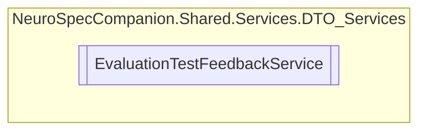

# EvaluationTestFeedbackService `Public class`

## Diagram


## Members
### Methods
#### Public  methods
| Returns | Name |
| --- | --- |
| `Task` | [`DeleteAllVisitFeedbackAsync`](#deleteallvisitfeedbackasync)(`int` visitId) |
| `Task` | [`DeleteFeedbackAsync`](#deletefeedbackasync)(`int` feedbackId) |
| `Task`&lt;`List`&lt;[`EvaluationTestFeedBack`](./neurospecsharedmodelsdto-EvaluationTestFeedBack)&gt;&gt; | [`GetAllFeedbackAsync`](#getallfeedbackasync)() |
| `Task`&lt;[`EvaluationTestFeedBack`](./neurospecsharedmodelsdto-EvaluationTestFeedBack)&gt; | [`GetFeedbackByIdAsync`](#getfeedbackbyidasync)(`int` feedbackId) |
| `Task`&lt;`List`&lt;[`EvaluationTestFeedBack`](./neurospecsharedmodelsdto-EvaluationTestFeedBack)&gt;&gt; | [`GetFeedbackByPatientAsync`](#getfeedbackbypatientasync)(`int` patientId) |
| `Task`&lt;`List`&lt;[`EvaluationTestFeedBack`](./neurospecsharedmodelsdto-EvaluationTestFeedBack)&gt;&gt; | [`GetFeedbackByVisitAsync`](#getfeedbackbyvisitasync)(`int` visitId) |
| `Task`&lt;[`EvaluationTestFeedBack`](./neurospecsharedmodelsdto-EvaluationTestFeedBack)&gt; | [`InsertFeedbackAsync`](#insertfeedbackasync)([`EvaluationTestFeedBack`](./neurospecsharedmodelsdto-EvaluationTestFeedBack) feedback) |

## Details
### Constructors
#### EvaluationTestFeedbackService
```csharp
public EvaluationTestFeedbackService()
```

### Methods
#### GetAllFeedbackAsync
```csharp
public async Task<List<EvaluationTestFeedBack>> GetAllFeedbackAsync()
```

#### GetFeedbackByIdAsync
```csharp
public async Task<EvaluationTestFeedBack> GetFeedbackByIdAsync(int feedbackId)
```
##### Arguments
| Type | Name | Description |
| --- | --- | --- |
| `int` | feedbackId |   |

#### GetFeedbackByPatientAsync
```csharp
public async Task<List<EvaluationTestFeedBack>> GetFeedbackByPatientAsync(int patientId)
```
##### Arguments
| Type | Name | Description |
| --- | --- | --- |
| `int` | patientId |   |

#### GetFeedbackByVisitAsync
```csharp
public async Task<List<EvaluationTestFeedBack>> GetFeedbackByVisitAsync(int visitId)
```
##### Arguments
| Type | Name | Description |
| --- | --- | --- |
| `int` | visitId |   |

#### InsertFeedbackAsync
```csharp
public async Task<EvaluationTestFeedBack> InsertFeedbackAsync(EvaluationTestFeedBack feedback)
```
##### Arguments
| Type | Name | Description |
| --- | --- | --- |
| [`EvaluationTestFeedBack`](./neurospecsharedmodelsdto-EvaluationTestFeedBack) | feedback |   |

#### DeleteFeedbackAsync
```csharp
public async Task DeleteFeedbackAsync(int feedbackId)
```
##### Arguments
| Type | Name | Description |
| --- | --- | --- |
| `int` | feedbackId |   |

#### DeleteAllVisitFeedbackAsync
```csharp
public async Task DeleteAllVisitFeedbackAsync(int visitId)
```
##### Arguments
| Type | Name | Description |
| --- | --- | --- |
| `int` | visitId |   |

*Generated with* [*ModularDoc*](https://github.com/hailstorm75/ModularDoc)
