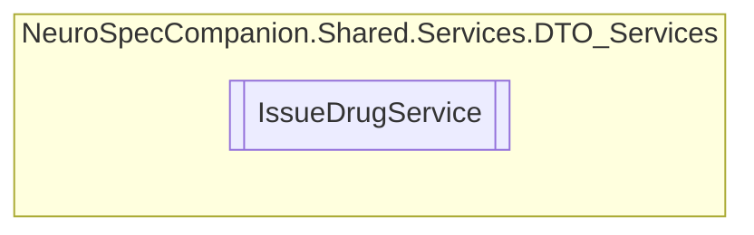

# IssueDrugService `Public class`

## Diagram


## Members
### Methods
#### Public  methods
| Returns | Name |
| --- | --- |
| `Task` | [`DeleteIssueDrugAsync`](#deleteissuedrugasync)(`int` issueID) |
| `Task`&lt;`List`&lt;[`IssueDrug`](./neurospecsharedmodelsdto-IssueDrug)&gt;&gt; | [`GetAllIssueDrugsAsync`](#getallissuedrugsasync)() |
| `Task`&lt;`List`&lt;[`IssueDrug`](./neurospecsharedmodelsdto-IssueDrug)&gt;&gt; | [`GetAllIssueDrugsByPatientIDAsync`](#getallissuedrugsbypatientidasync)(`int` patientID) |
| `Task`&lt;`List`&lt;[`IssueDrug`](./neurospecsharedmodelsdto-IssueDrug)&gt;&gt; | [`GetAllIssueDrugsByPrescriptionIDAsync`](#getallissuedrugsbyprescriptionidasync)(`int` prescriptionID) |
| `Task`&lt;[`IssueDrug`](./neurospecsharedmodelsdto-IssueDrug)&gt; | [`GetIssueDrugByIdAsync`](#getissuedrugbyidasync)(`int` issueID) |
| `Task`&lt;[`IssueDrug`](./neurospecsharedmodelsdto-IssueDrug)&gt; | [`InsertIssueDrugAsync`](#insertissuedrugasync)([`IssueDrug`](./neurospecsharedmodelsdto-IssueDrug) IssueDrug) |
| `Task` | [`UpdateIssueDrugAsync`](#updateissuedrugasync)(`int` issueID, [`IssueDrug`](./neurospecsharedmodelsdto-IssueDrug) IssueDrug) |

## Details
### Constructors
#### IssueDrugService
```csharp
public IssueDrugService()
```

### Methods
#### GetAllIssueDrugsAsync
```csharp
public async Task<List<IssueDrug>> GetAllIssueDrugsAsync()
```

#### GetIssueDrugByIdAsync
```csharp
public async Task<IssueDrug> GetIssueDrugByIdAsync(int issueID)
```
##### Arguments
| Type | Name | Description |
| --- | --- | --- |
| `int` | issueID |   |

#### GetAllIssueDrugsByPatientIDAsync
```csharp
public async Task<List<IssueDrug>> GetAllIssueDrugsByPatientIDAsync(int patientID)
```
##### Arguments
| Type | Name | Description |
| --- | --- | --- |
| `int` | patientID |   |

#### GetAllIssueDrugsByPrescriptionIDAsync
```csharp
public async Task<List<IssueDrug>> GetAllIssueDrugsByPrescriptionIDAsync(int prescriptionID)
```
##### Arguments
| Type | Name | Description |
| --- | --- | --- |
| `int` | prescriptionID |   |

#### InsertIssueDrugAsync
```csharp
public async Task<IssueDrug> InsertIssueDrugAsync(IssueDrug IssueDrug)
```
##### Arguments
| Type | Name | Description |
| --- | --- | --- |
| [`IssueDrug`](./neurospecsharedmodelsdto-IssueDrug) | IssueDrug |   |

#### UpdateIssueDrugAsync
```csharp
public async Task UpdateIssueDrugAsync(int issueID, IssueDrug IssueDrug)
```
##### Arguments
| Type | Name | Description |
| --- | --- | --- |
| `int` | issueID |   |
| [`IssueDrug`](./neurospecsharedmodelsdto-IssueDrug) | IssueDrug |   |

#### DeleteIssueDrugAsync
```csharp
public async Task DeleteIssueDrugAsync(int issueID)
```
##### Arguments
| Type | Name | Description |
| --- | --- | --- |
| `int` | issueID |   |

*Generated with* [*ModularDoc*](https://github.com/hailstorm75/ModularDoc)
