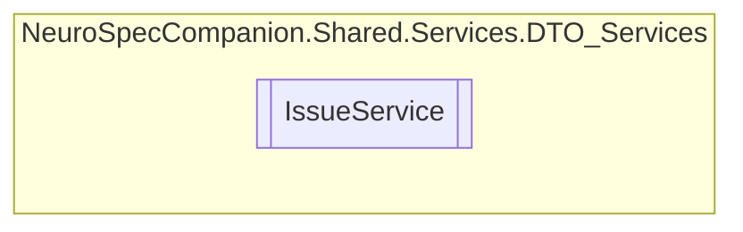

# IssueService `Public class`

## Diagram


## Members
### Methods
#### Public  methods
| Returns | Name |
| --- | --- |
| `Task` | [`DeleteIssueAsync`](#deleteissueasync)(`int` issueID) |
| `Task`&lt;`List`&lt;[`Issue`](./neurospecsharedmodelsdto-Issue)&gt;&gt; | [`GetAllIssuesAsync`](#getallissuesasync)() |
| `Task`&lt;`List`&lt;[`Issue`](./neurospecsharedmodelsdto-Issue)&gt;&gt; | [`GetAllIssuesByPatientIDAsync`](#getallissuesbypatientidasync)(`int` patientID) |
| `Task`&lt;`List`&lt;[`Issue`](./neurospecsharedmodelsdto-Issue)&gt;&gt; | [`GetAllIssuesByPrescriptionIDAsync`](#getallissuesbyprescriptionidasync)(`int` prescriptionID) |
| `Task`&lt;[`Issue`](./neurospecsharedmodelsdto-Issue)&gt; | [`GetIssueByIdAsync`](#getissuebyidasync)(`int` issueID) |
| `Task`&lt;[`Issue`](./neurospecsharedmodelsdto-Issue)&gt; | [`InsertIssueAsync`](#insertissueasync)([`Issue`](./neurospecsharedmodelsdto-Issue) Issue) |
| `Task` | [`UpdateIssueAsync`](#updateissueasync)(`int` issueID, [`Issue`](./neurospecsharedmodelsdto-Issue) Issue) |

## Details
### Constructors
#### IssueService
```csharp
public IssueService()
```

### Methods
#### GetAllIssuesAsync
```csharp
public async Task<List<Issue>> GetAllIssuesAsync()
```

#### GetIssueByIdAsync
```csharp
public async Task<Issue> GetIssueByIdAsync(int issueID)
```
##### Arguments
| Type | Name | Description |
| --- | --- | --- |
| `int` | issueID |   |

#### GetAllIssuesByPatientIDAsync
```csharp
public async Task<List<Issue>> GetAllIssuesByPatientIDAsync(int patientID)
```
##### Arguments
| Type | Name | Description |
| --- | --- | --- |
| `int` | patientID |   |

#### GetAllIssuesByPrescriptionIDAsync
```csharp
public async Task<List<Issue>> GetAllIssuesByPrescriptionIDAsync(int prescriptionID)
```
##### Arguments
| Type | Name | Description |
| --- | --- | --- |
| `int` | prescriptionID |   |

#### InsertIssueAsync
```csharp
public async Task<Issue> InsertIssueAsync(Issue Issue)
```
##### Arguments
| Type | Name | Description |
| --- | --- | --- |
| [`Issue`](./neurospecsharedmodelsdto-Issue) | Issue |   |

#### UpdateIssueAsync
```csharp
public async Task UpdateIssueAsync(int issueID, Issue Issue)
```
##### Arguments
| Type | Name | Description |
| --- | --- | --- |
| `int` | issueID |   |
| [`Issue`](./neurospecsharedmodelsdto-Issue) | Issue |   |

#### DeleteIssueAsync
```csharp
public async Task DeleteIssueAsync(int issueID)
```
##### Arguments
| Type | Name | Description |
| --- | --- | --- |
| `int` | issueID |   |

*Generated with* [*ModularDoc*](https://github.com/hailstorm75/ModularDoc)
