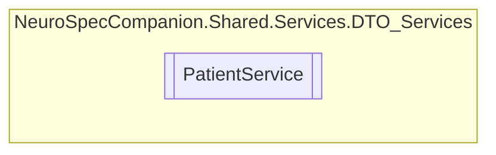

# PatientService `Public class`

## Diagram


## Members
### Methods
#### Public  methods
| Returns | Name |
| --- | --- |
| `Task`&lt;`List`&lt;[`Patient`](./neurospecsharedmodelsdto-Patient)&gt;&gt; | [`GetAllPatientsAsync`](#getallpatientsasync)() |
| `Task`&lt;`Patient`&gt; | [`GetFHIRPatientByIdAsync`](#getfhirpatientbyidasync)(`int` patientID) |
| `Task`&lt;[`Patient`](./neurospecsharedmodelsdto-Patient)&gt; | [`GetPatientByIdAsync`](#getpatientbyidasync)(`int` patientID) |
| `Task`&lt;`List`&lt;[`Patient`](./neurospecsharedmodelsdto-Patient)&gt;&gt; | [`GetPatientsByDoctorAsync`](#getpatientsbydoctorasync)(`int` doctorID) |
| `Task`&lt;[`Patient`](./neurospecsharedmodelsdto-Patient)&gt; | [`InsertPatientAsync`](#insertpatientasync)([`Patient`](./neurospecsharedmodelsdto-Patient) patient) |
| `Task`&lt;[`Patient`](./neurospecsharedmodelsdto-Patient)&gt; | [`UpdatePatientAsync`](#updatepatientasync)([`Patient`](./neurospecsharedmodelsdto-Patient) patient) |
| `Task`&lt;`bool`&gt; | [`VerifyPatientAsync`](#verifypatientasync)(`int` patientID, `string` password) |

## Details
### Constructors
#### PatientService
```csharp
public PatientService()
```

### Methods
#### GetAllPatientsAsync
```csharp
public async Task<List<Patient>> GetAllPatientsAsync()
```

#### GetPatientByIdAsync
```csharp
public async Task<Patient> GetPatientByIdAsync(int patientID)
```
##### Arguments
| Type | Name | Description |
| --- | --- | --- |
| `int` | patientID |   |

#### GetFHIRPatientByIdAsync
```csharp
public async Task<Patient> GetFHIRPatientByIdAsync(int patientID)
```
##### Arguments
| Type | Name | Description |
| --- | --- | --- |
| `int` | patientID |   |

#### VerifyPatientAsync
```csharp
public async Task<bool> VerifyPatientAsync(int patientID, string password)
```
##### Arguments
| Type | Name | Description |
| --- | --- | --- |
| `int` | patientID |   |
| `string` | password |   |

#### UpdatePatientAsync
```csharp
public async Task<Patient> UpdatePatientAsync(Patient patient)
```
##### Arguments
| Type | Name | Description |
| --- | --- | --- |
| [`Patient`](./neurospecsharedmodelsdto-Patient) | patient |   |

#### InsertPatientAsync
```csharp
public async Task<Patient> InsertPatientAsync(Patient patient)
```
##### Arguments
| Type | Name | Description |
| --- | --- | --- |
| [`Patient`](./neurospecsharedmodelsdto-Patient) | patient |   |

#### GetPatientsByDoctorAsync
```csharp
public async Task<List<Patient>> GetPatientsByDoctorAsync(int doctorID)
```
##### Arguments
| Type | Name | Description |
| --- | --- | --- |
| `int` | doctorID |   |

*Generated with* [*ModularDoc*](https://github.com/hailstorm75/ModularDoc)
