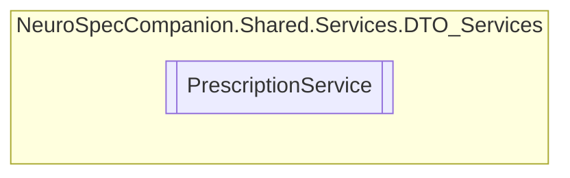

# PrescriptionService `Public class`

## Diagram


## Members
### Methods
#### Public  methods
| Returns | Name |
| --- | --- |
| `Task` | [`DeletePrescriptionAsync`](#deleteprescriptionasync)(`int` prescriptionID) |
| `Task`&lt;`List`&lt;[`Prescription`](./neurospecsharedmodelsdto-Prescription)&gt;&gt; | [`GetAllPrescriptionsAsync`](#getallprescriptionsasync)() |
| `Task`&lt;`List`&lt;[`Prescription`](./neurospecsharedmodelsdto-Prescription)&gt;&gt; | [`GetAllPrescriptionsByPatientIDAsync`](#getallprescriptionsbypatientidasync)(`int` patientID) |
| `Task`&lt;`List`&lt;[`Prescription`](./neurospecsharedmodelsdto-Prescription)&gt;&gt; | [`GetAllPrescriptionsByVisitIDAsync`](#getallprescriptionsbyvisitidasync)(`int` visitID) |
| `Task`&lt;[`Prescription`](./neurospecsharedmodelsdto-Prescription)&gt; | [`GetPrescriptionByIDAsync`](#getprescriptionbyidasync)(`int` prescriptionID) |
| `Task`&lt;[`Prescription`](./neurospecsharedmodelsdto-Prescription)&gt; | [`InsertPrescriptionAsync`](#insertprescriptionasync)([`Prescription`](./neurospecsharedmodelsdto-Prescription) prescription) |
| `Task` | [`UpdatePrescriptionAsync`](#updateprescriptionasync)(`int` prescriptionID, [`Prescription`](./neurospecsharedmodelsdto-Prescription) prescription) |

## Details
### Constructors
#### PrescriptionService
```csharp
public PrescriptionService()
```

### Methods
#### GetAllPrescriptionsAsync
```csharp
public async Task<List<Prescription>> GetAllPrescriptionsAsync()
```

#### GetPrescriptionByIDAsync
```csharp
public async Task<Prescription> GetPrescriptionByIDAsync(int prescriptionID)
```
##### Arguments
| Type | Name | Description |
| --- | --- | --- |
| `int` | prescriptionID |   |

#### GetAllPrescriptionsByPatientIDAsync
```csharp
public async Task<List<Prescription>> GetAllPrescriptionsByPatientIDAsync(int patientID)
```
##### Arguments
| Type | Name | Description |
| --- | --- | --- |
| `int` | patientID |   |

#### GetAllPrescriptionsByVisitIDAsync
```csharp
public async Task<List<Prescription>> GetAllPrescriptionsByVisitIDAsync(int visitID)
```
##### Arguments
| Type | Name | Description |
| --- | --- | --- |
| `int` | visitID |   |

#### InsertPrescriptionAsync
```csharp
public async Task<Prescription> InsertPrescriptionAsync(Prescription prescription)
```
##### Arguments
| Type | Name | Description |
| --- | --- | --- |
| [`Prescription`](./neurospecsharedmodelsdto-Prescription) | prescription |   |

#### UpdatePrescriptionAsync
```csharp
public async Task UpdatePrescriptionAsync(int prescriptionID, Prescription prescription)
```
##### Arguments
| Type | Name | Description |
| --- | --- | --- |
| `int` | prescriptionID |   |
| [`Prescription`](./neurospecsharedmodelsdto-Prescription) | prescription |   |

#### DeletePrescriptionAsync
```csharp
public async Task DeletePrescriptionAsync(int prescriptionID)
```
##### Arguments
| Type | Name | Description |
| --- | --- | --- |
| `int` | prescriptionID |   |

*Generated with* [*ModularDoc*](https://github.com/hailstorm75/ModularDoc)
