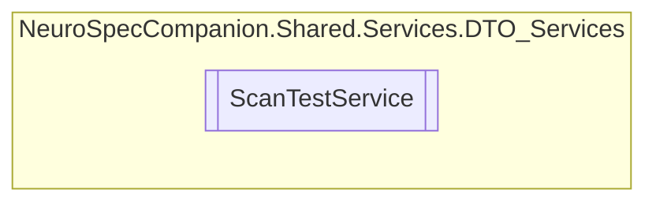

# ScanTestService `Public class`

## Diagram


## Members
### Methods
#### Public  methods
| Returns | Name |
| --- | --- |
| `Task` | [`DeleteScanTestAsync`](#deletescantestasync)(`int` scanTestID) |
| `Task`&lt;`IEnumerable`&lt;[`ScanTest`](./neurospecsharedmodelsdto-ScanTest)&gt;&gt; | [`GetAllScanTestsAsync`](#getallscantestsasync)() |
| `Task`&lt;[`ScanTest`](./neurospecsharedmodelsdto-ScanTest)&gt; | [`GetScanTestByIdAsync`](#getscantestbyidasync)(`int` scanTestID) |
| `Task`&lt;[`ScanTest`](./neurospecsharedmodelsdto-ScanTest)&gt; | [`InsertScanTestAsync`](#insertscantestasync)([`ScanTest`](./neurospecsharedmodelsdto-ScanTest) scanTest) |
| `Task` | [`UpdateScanTestAsync`](#updatescantestasync)(`int` scanTestID, [`ScanTest`](./neurospecsharedmodelsdto-ScanTest) scanTest) |

## Details
### Constructors
#### ScanTestService
```csharp
public ScanTestService()
```

### Methods
#### GetAllScanTestsAsync
```csharp
public async Task<IEnumerable<ScanTest>> GetAllScanTestsAsync()
```

#### GetScanTestByIdAsync
```csharp
public async Task<ScanTest> GetScanTestByIdAsync(int scanTestID)
```
##### Arguments
| Type | Name | Description |
| --- | --- | --- |
| `int` | scanTestID |   |

#### InsertScanTestAsync
```csharp
public async Task<ScanTest> InsertScanTestAsync(ScanTest scanTest)
```
##### Arguments
| Type | Name | Description |
| --- | --- | --- |
| [`ScanTest`](./neurospecsharedmodelsdto-ScanTest) | scanTest |   |

#### UpdateScanTestAsync
```csharp
public async Task UpdateScanTestAsync(int scanTestID, ScanTest scanTest)
```
##### Arguments
| Type | Name | Description |
| --- | --- | --- |
| `int` | scanTestID |   |
| [`ScanTest`](./neurospecsharedmodelsdto-ScanTest) | scanTest |   |

#### DeleteScanTestAsync
```csharp
public async Task DeleteScanTestAsync(int scanTestID)
```
##### Arguments
| Type | Name | Description |
| --- | --- | --- |
| `int` | scanTestID |   |

*Generated with* [*ModularDoc*](https://github.com/hailstorm75/ModularDoc)
