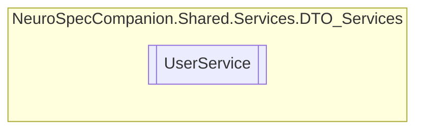

# UserService `Public class`

## Diagram


## Members
### Methods
#### Public  methods
| Returns | Name |
| --- | --- |
| `Task` | [`DeleteUserAsync`](#deleteuserasync)(`int` id) |
| `Task`&lt;`List`&lt;[`User`](./neurospecsharedmodelsdto-User)&gt;&gt; | [`GetAllAdminsAsync`](#getalladminsasync)() |
| `Task`&lt;`List`&lt;[`User`](./neurospecsharedmodelsdto-User)&gt;&gt; | [`GetAllDoctorsAsync`](#getalldoctorsasync)() |
| `Task`&lt;`List`&lt;[`User`](./neurospecsharedmodelsdto-User)&gt;&gt; | [`GetAllEmployeesAsync`](#getallemployeesasync)() |
| `Task`&lt;`List`&lt;[`User`](./neurospecsharedmodelsdto-User)&gt;&gt; | [`GetAllUsersAsync`](#getallusersasync)() |
| `Task`&lt;[`User`](./neurospecsharedmodelsdto-User)&gt; | [`GetUserByIdAsync`](#getuserbyidasync)(`int` id) |
| `Task`&lt;[`User`](./neurospecsharedmodelsdto-User)&gt; | [`GetUserByNIDAsync`](#getuserbynidasync)(`string` nid) |
| `Task`&lt;[`User`](./neurospecsharedmodelsdto-User)&gt; | [`InsertUserAsync`](#insertuserasync)([`User`](./neurospecsharedmodelsdto-User) user) |

## Details
### Constructors
#### UserService
```csharp
public UserService()
```

### Methods
#### GetAllUsersAsync
```csharp
public async Task<List<User>> GetAllUsersAsync()
```

#### GetUserByIdAsync
```csharp
public async Task<User> GetUserByIdAsync(int id)
```
##### Arguments
| Type | Name | Description |
| --- | --- | --- |
| `int` | id |   |

#### GetAllEmployeesAsync
```csharp
public async Task<List<User>> GetAllEmployeesAsync()
```

#### GetAllDoctorsAsync
```csharp
public async Task<List<User>> GetAllDoctorsAsync()
```

#### GetAllAdminsAsync
```csharp
public async Task<List<User>> GetAllAdminsAsync()
```

#### GetUserByNIDAsync
```csharp
public async Task<User> GetUserByNIDAsync(string nid)
```
##### Arguments
| Type | Name | Description |
| --- | --- | --- |
| `string` | nid |   |

#### InsertUserAsync
```csharp
public async Task<User> InsertUserAsync(User user)
```
##### Arguments
| Type | Name | Description |
| --- | --- | --- |
| [`User`](./neurospecsharedmodelsdto-User) | user |   |

#### DeleteUserAsync
```csharp
public async Task DeleteUserAsync(int id)
```
##### Arguments
| Type | Name | Description |
| --- | --- | --- |
| `int` | id |   |

*Generated with* [*ModularDoc*](https://github.com/hailstorm75/ModularDoc)
