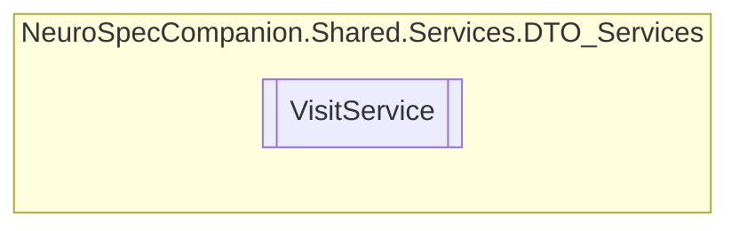

# VisitService `Public class`

## Diagram


## Members
### Methods
#### Public  methods
| Returns | Name |
| --- | --- |
| `Task` | [`DeleteVisitAsync`](#deletevisitasync)(`int` visitID) |
| `Task`&lt;`List`&lt;[`Visit`](./neurospecsharedmodelsdto-Visit)&gt;&gt; | [`GetAllVisitsByPatientIDAsync`](#getallvisitsbypatientidasync)(`int` patientID) |
| `Task`&lt;`List`&lt;`string`&gt;&gt; | [`GetAvailableTimeSlotsOnDayAsync`](#getavailabletimeslotsondayasync)(`DateTime` selectedDay, `int` doctorID) |
| `Task`&lt;`List`&lt;[`Visit`](./neurospecsharedmodelsdto-Visit)&gt;&gt; | [`GetDoctorVisitsAsync`](#getdoctorvisitsasync)(`int` doctorID) |
| `Task`&lt;`List`&lt;[`Visit`](./neurospecsharedmodelsdto-Visit)&gt;&gt; | [`GetDoctorVisitsOnDateAsync`](#getdoctorvisitsondateasync)(`int` doctorID, `DateTime` dateTime) |
| `Task`&lt;`List`&lt;[`Visit`](./neurospecsharedmodelsdto-Visit)&gt;&gt; | [`GetFutureDoctorVisitsAsync`](#getfuturedoctorvisitsasync)(`int` doctorID) |
| `Task`&lt;[`Visit`](./neurospecsharedmodelsdto-Visit)&gt; | [`GetVisitByIDAsync`](#getvisitbyidasync)(`int` visitID) |
| `Task`&lt;`List`&lt;[`Visit`](./neurospecsharedmodelsdto-Visit)&gt;&gt; | [`GetVisitsByDateAsync`](#getvisitsbydateasync)(`DateTime` selectedDay) |
| `Task`&lt;[`Visit`](./neurospecsharedmodelsdto-Visit)&gt; | [`InsertVisitAsync`](#insertvisitasync)([`Visit`](./neurospecsharedmodelsdto-Visit) visit) |
| `Task` | [`UpdateVisitAsync`](#updatevisitasync)(`int` visitID, [`Visit`](./neurospecsharedmodelsdto-Visit) visit) |

## Details
### Constructors
#### VisitService
```csharp
public VisitService()
```

### Methods
#### GetAllVisitsByPatientIDAsync
```csharp
public async Task<List<Visit>> GetAllVisitsByPatientIDAsync(int patientID)
```
##### Arguments
| Type | Name | Description |
| --- | --- | --- |
| `int` | patientID |   |

#### InsertVisitAsync
```csharp
public async Task<Visit> InsertVisitAsync(Visit visit)
```
##### Arguments
| Type | Name | Description |
| --- | --- | --- |
| [`Visit`](./neurospecsharedmodelsdto-Visit) | visit |   |

#### UpdateVisitAsync
```csharp
public async Task UpdateVisitAsync(int visitID, Visit visit)
```
##### Arguments
| Type | Name | Description |
| --- | --- | --- |
| `int` | visitID |   |
| [`Visit`](./neurospecsharedmodelsdto-Visit) | visit |   |

#### DeleteVisitAsync
```csharp
public async Task DeleteVisitAsync(int visitID)
```
##### Arguments
| Type | Name | Description |
| --- | --- | --- |
| `int` | visitID |   |

#### GetVisitByIDAsync
```csharp
public async Task<Visit> GetVisitByIDAsync(int visitID)
```
##### Arguments
| Type | Name | Description |
| --- | --- | --- |
| `int` | visitID |   |

#### GetAvailableTimeSlotsOnDayAsync
```csharp
public async Task<List<string>> GetAvailableTimeSlotsOnDayAsync(DateTime selectedDay, int doctorID)
```
##### Arguments
| Type | Name | Description |
| --- | --- | --- |
| `DateTime` | selectedDay |   |
| `int` | doctorID |   |

#### GetVisitsByDateAsync
```csharp
public async Task<List<Visit>> GetVisitsByDateAsync(DateTime selectedDay)
```
##### Arguments
| Type | Name | Description |
| --- | --- | --- |
| `DateTime` | selectedDay |   |

#### GetDoctorVisitsOnDateAsync
```csharp
public async Task<List<Visit>> GetDoctorVisitsOnDateAsync(int doctorID, DateTime dateTime)
```
##### Arguments
| Type | Name | Description |
| --- | --- | --- |
| `int` | doctorID |   |
| `DateTime` | dateTime |   |

#### GetDoctorVisitsAsync
```csharp
public async Task<List<Visit>> GetDoctorVisitsAsync(int doctorID)
```
##### Arguments
| Type | Name | Description |
| --- | --- | --- |
| `int` | doctorID |   |

#### GetFutureDoctorVisitsAsync
```csharp
public async Task<List<Visit>> GetFutureDoctorVisitsAsync(int doctorID)
```
##### Arguments
| Type | Name | Description |
| --- | --- | --- |
| `int` | doctorID |   |

*Generated with* [*ModularDoc*](https://github.com/hailstorm75/ModularDoc)
