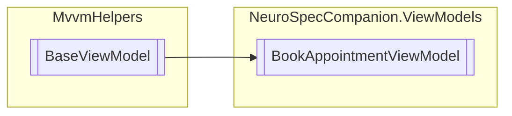

# BookAppointmentViewModel `Public class`

## Diagram


## Members
### Properties
#### Public  properties
| Type | Name | Methods |
| --- | --- | --- |
| `ObservableCollection`&lt;[`AppointmentType`](./neurospecsharedmodelsdto-AppointmentType)&gt; | [`AppointmentTypes`](#appointmenttypes) | `get` |
| `ObservableCollection`&lt;`string`&gt; | [`AvailableTimes`](#availabletimes) | `get` |
| `ICommand` | [`BookAppointmentCommand`](#bookappointmentcommand) | `get` |
| `bool` | [`IsUrgent`](#isurgent) | `get, set` |
| `string` | [`Reason`](#reason) | `get, set` |
| [`AppointmentType`](./neurospecsharedmodelsdto-AppointmentType) | [`SelectedAppointmentType`](#selectedappointmenttype) | `get, set` |
| `DateTime` | [`SelectedDate`](#selecteddate) | `get, set` |
| `ICommand` | [`SelectedDateChangedCommand`](#selecteddatechangedcommand) | `get` |
| `string` | [`SelectedTime`](#selectedtime) | `get, set` |

## Details
### Inheritance
 - `BaseViewModel`

### Constructors
#### BookAppointmentViewModel
```csharp
public BookAppointmentViewModel()
```

### Properties
#### AppointmentTypes
```csharp
public ObservableCollection<AppointmentType> AppointmentTypes { get; }
```

#### AvailableTimes
```csharp
public ObservableCollection<string> AvailableTimes { get; }
```

#### SelectedAppointmentType
```csharp
public AppointmentType SelectedAppointmentType { get; set; }
```

#### SelectedDate
```csharp
public DateTime SelectedDate { get; set; }
```

#### SelectedTime
```csharp
public string SelectedTime { get; set; }
```

#### Reason
```csharp
public string Reason { get; set; }
```

#### IsUrgent
```csharp
public bool IsUrgent { get; set; }
```

#### BookAppointmentCommand
```csharp
public ICommand BookAppointmentCommand { get; }
```

#### SelectedDateChangedCommand
```csharp
public ICommand SelectedDateChangedCommand { get; }
```

*Generated with* [*ModularDoc*](https://github.com/hailstorm75/ModularDoc)
