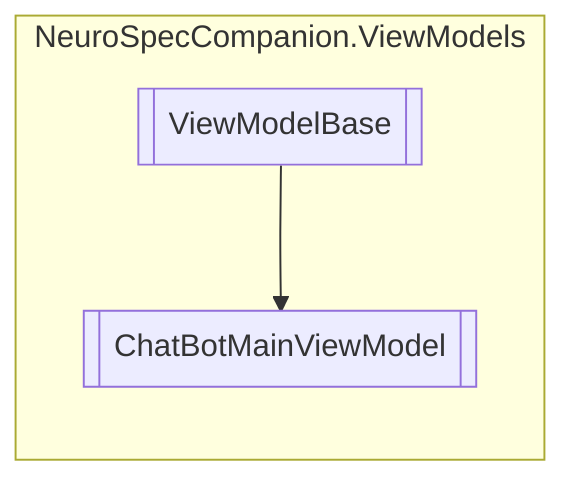

# ChatBotMainViewModel `Public class`

## Diagram


## Members
### Properties
#### Public  properties
| Type | Name | Methods |
| --- | --- | --- |
| `string` | [`EntryText`](#entrytext) | `get, set` |
| `ObservableCollection`&lt;`HorizontalStackLayout`&gt; | [`Messages`](#messages) | `get` |
| `ICommand` | [`SendCommand`](#sendcommand) | `get` |

### Methods
#### Protected  methods
| Returns | Name |
| --- | --- |
| `void` | [`OnPropertyChanged`](#onpropertychanged)(`string` propertyName) |

#### Public  methods
| Returns | Name |
| --- | --- |
| `Task` | [`InitializeAsync`](#initializeasync)(`object` navigationData) |

## Details
### Inheritance
 - [
`ViewModelBase`
](./neurospeccompanionviewmodels-ViewModelBase)

### Constructors
#### ChatBotMainViewModel
```csharp
public ChatBotMainViewModel()
```

### Methods
#### OnPropertyChanged
```csharp
protected virtual void OnPropertyChanged(string propertyName)
```
##### Arguments
| Type | Name | Description |
| --- | --- | --- |
| `string` | propertyName |   |

#### InitializeAsync
```csharp
public override Task InitializeAsync(object navigationData)
```
##### Arguments
| Type | Name | Description |
| --- | --- | --- |
| `object` | navigationData |   |

### Properties
#### Messages
```csharp
public ObservableCollection<HorizontalStackLayout> Messages { get; }
```

#### SendCommand
```csharp
public ICommand SendCommand { get; }
```

#### EntryText
```csharp
public string EntryText { get; set; }
```

### Events
#### PropertyChanged
```csharp
public event PropertyChangedEventHandler PropertyChanged
```

*Generated with* [*ModularDoc*](https://github.com/hailstorm75/ModularDoc)
