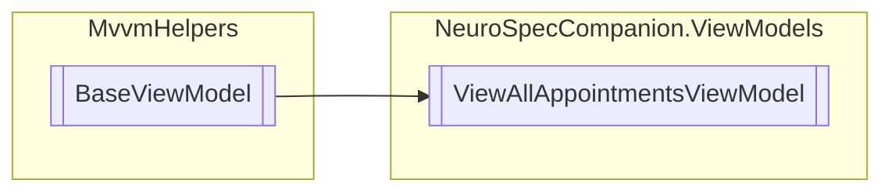

# ViewAllAppointmentsViewModel `Public class`

## Diagram


## Members
### Properties
#### Public  properties
| Type | Name | Methods |
| --- | --- | --- |
| `ICommand` | [`BookAppointmentCommand`](#bookappointmentcommand) | `get` |
| `ICommand` | [`DeleteVisitCommand`](#deletevisitcommand) | `get` |
| `ICommand` | [`ViewVisitCommand`](#viewvisitcommand) | `get` |
| `ObservableCollection`&lt;[`Visit`](./neurospecsharedmodelsdto-Visit)&gt; | [`Visits`](#visits) | `get` |

## Details
### Inheritance
 - `BaseViewModel`

### Constructors
#### ViewAllAppointmentsViewModel
```csharp
public ViewAllAppointmentsViewModel()
```

### Properties
#### Visits
```csharp
public ObservableCollection<Visit> Visits { get; }
```

#### DeleteVisitCommand
```csharp
public ICommand DeleteVisitCommand { get; }
```

#### ViewVisitCommand
```csharp
public ICommand ViewVisitCommand { get; }
```

#### BookAppointmentCommand
```csharp
public ICommand BookAppointmentCommand { get; }
```

*Generated with* [*ModularDoc*](https://github.com/hailstorm75/ModularDoc)
