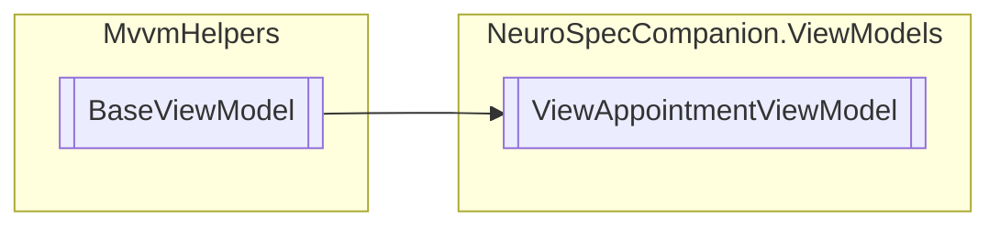

# ViewAppointmentViewModel `Public class`

## Diagram


## Members
### Properties
#### Public  properties
| Type | Name | Methods |
| --- | --- | --- |
| [`Visit`](./neurospecsharedmodelsdto-Visit) | [`Visit`](#visit) | `get, set` |

### Methods
#### Protected  methods
| Returns | Name |
| --- | --- |
| `void` | [`OnPropertyChanged`](#onpropertychanged)(`string` propertyName) |

## Details
### Inheritance
 - `BaseViewModel`

### Constructors
#### ViewAppointmentViewModel
```csharp
public ViewAppointmentViewModel()
```

### Methods
#### OnPropertyChanged
```csharp
protected override void OnPropertyChanged(string propertyName)
```
##### Arguments
| Type | Name | Description |
| --- | --- | --- |
| `string` | propertyName |   |

### Properties
#### Visit
```csharp
public Visit Visit { get; set; }
```

### Events
#### PropertyChanged
```csharp
public event PropertyChangedEventHandler PropertyChanged
```

*Generated with* [*ModularDoc*](https://github.com/hailstorm75/ModularDoc)
