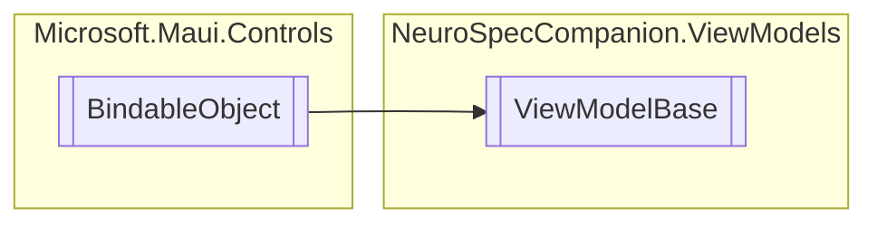

# ViewModelBase `Public class`

## Diagram


## Members
### Methods
#### Public  methods
| Returns | Name |
| --- | --- |
| `Task` | [`InitializeAsync`](#initializeasync)(`object` navigationData) |

## Details
### Inheritance
 - `BindableObject`

### Constructors
#### ViewModelBase
```csharp
public ViewModelBase()
```

### Methods
#### InitializeAsync
```csharp
public virtual Task InitializeAsync(object navigationData)
```
##### Arguments
| Type | Name | Description |
| --- | --- | --- |
| `object` | navigationData |   |

*Generated with* [*ModularDoc*](https://github.com/hailstorm75/ModularDoc)
