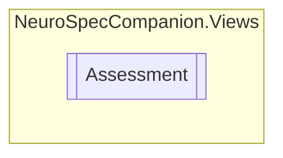

# Assessment `Public class`

## Diagram


## Members
### Properties
#### Public  properties
| Type | Name | Methods |
| --- | --- | --- |
| `string` | [`AssessmentDate`](#assessmentdate) | `get, set` |
| `ObservableCollection`&lt;[`Medication`](./neurospeccompanionviews-Medication)&gt; | [`Medications`](#medications) | `get, set` |

## Details
### Constructors
#### Assessment
```csharp
public Assessment()
```

### Properties
#### AssessmentDate
```csharp
public string AssessmentDate { get; set; }
```

#### Medications
```csharp
public ObservableCollection<Medication> Medications { get; set; }
```

*Generated with* [*ModularDoc*](https://github.com/hailstorm75/ModularDoc)
