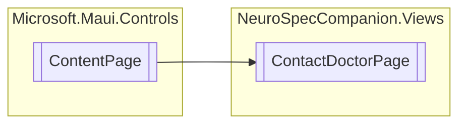

# ContactDoctorPage `Public class`

## Diagram


## Details
### Inheritance
 - `ContentPage`

### Constructors
#### ContactDoctorPage
```csharp
public ContactDoctorPage()
```

*Generated with* [*ModularDoc*](https://github.com/hailstorm75/ModularDoc)
