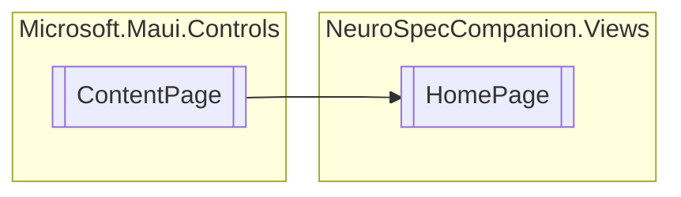

# HomePage `Public class`

## Diagram


## Details
### Inheritance
 - `ContentPage`

### Constructors
#### HomePage
```csharp
public HomePage()
```

*Generated with* [*ModularDoc*](https://github.com/hailstorm75/ModularDoc)
