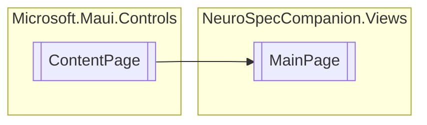

# MainPage `Public class`

## Diagram


## Details
### Inheritance
 - `ContentPage`

### Constructors
#### MainPage
```csharp
public MainPage()
```

*Generated with* [*ModularDoc*](https://github.com/hailstorm75/ModularDoc)
