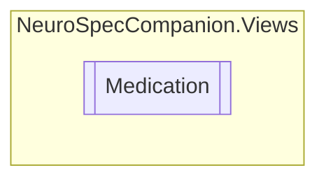

# Medication `Public class`

## Diagram


## Members
### Properties
#### Public  properties
| Type | Name | Methods |
| --- | --- | --- |
| `string` | [`Frequency`](#frequency) | `get, set` |
| `string` | [`Name`](#name) | `get, set` |

## Details
### Constructors
#### Medication
```csharp
public Medication()
```

### Properties
#### Name
```csharp
public string Name { get; set; }
```

#### Frequency
```csharp
public string Frequency { get; set; }
```

*Generated with* [*ModularDoc*](https://github.com/hailstorm75/ModularDoc)
