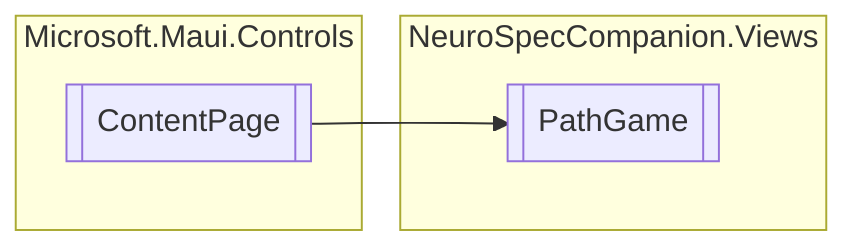

# PathGame `Public class`

## Diagram


## Details
### Inheritance
 - `ContentPage`

### Nested types
#### Enums
 - `TouchActionType`

#### Classes
 - `TouchActionEventArgs`

### Constructors
#### PathGame
```csharp
public PathGame()
```

*Generated with* [*ModularDoc*](https://github.com/hailstorm75/ModularDoc)
