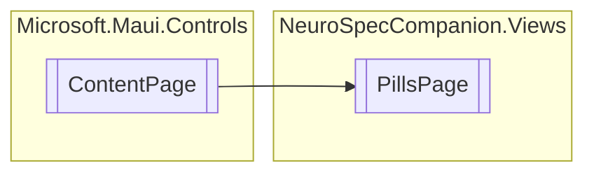

# PillsPage `Public class`

## Diagram


## Members
### Properties
#### Public  properties
| Type | Name | Methods |
| --- | --- | --- |
| `ObservableCollection`&lt;[`Assessment`](./neurospeccompanionviews-Assessment)&gt; | [`Assessments`](#assessments) | `get, set` |

## Details
### Inheritance
 - `ContentPage`

### Constructors
#### PillsPage
```csharp
public PillsPage()
```

### Properties
#### Assessments
```csharp
public ObservableCollection<Assessment> Assessments { get; set; }
```

*Generated with* [*ModularDoc*](https://github.com/hailstorm75/ModularDoc)
