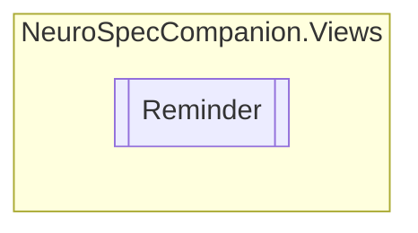

# Reminder `Public class`

## Diagram


## Members
### Properties
#### Public  properties
| Type | Name | Methods |
| --- | --- | --- |
| `string` | [`Category`](#category) | `get, set` |
| `TimeSpan` | [`Time`](#time) | `get, set` |
| `string` | [`Title`](#title) | `get, set` |

## Details
### Constructors
#### Reminder
```csharp
public Reminder()
```

### Properties
#### Title
```csharp
public string Title { get; set; }
```

#### Category
```csharp
public string Category { get; set; }
```

#### Time
```csharp
public TimeSpan Time { get; set; }
```

*Generated with* [*ModularDoc*](https://github.com/hailstorm75/ModularDoc)
