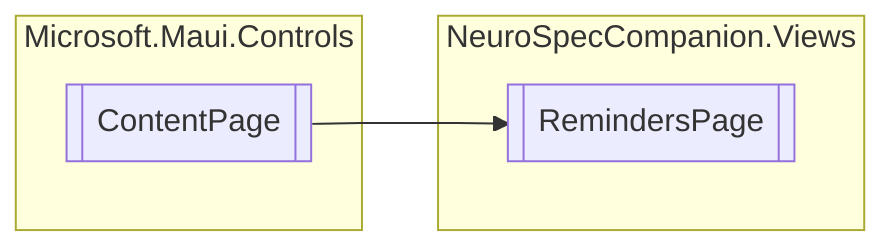

# RemindersPage `Public class`

## Diagram


## Members
### Properties
#### Public  properties
| Type | Name | Methods |
| --- | --- | --- |
| `ObservableCollection`&lt;[`Reminder`](./neurospeccompanionviews-Reminder)&gt; | [`Reminders`](#reminders) | `get, set` |

## Details
### Inheritance
 - `ContentPage`

### Constructors
#### RemindersPage
```csharp
public RemindersPage()
```

### Properties
#### Reminders
```csharp
public ObservableCollection<Reminder> Reminders { get; set; }
```

*Generated with* [*ModularDoc*](https://github.com/hailstorm75/ModularDoc)
