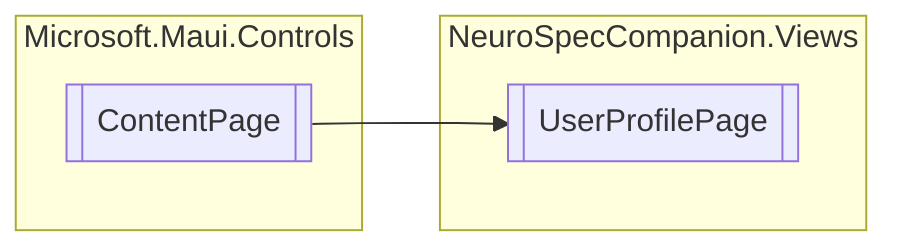

# UserProfilePage `Public class`

## Diagram


## Details
### Inheritance
 - `ContentPage`

### Constructors
#### UserProfilePage
```csharp
public UserProfilePage()
```

*Generated with* [*ModularDoc*](https://github.com/hailstorm75/ModularDoc)
