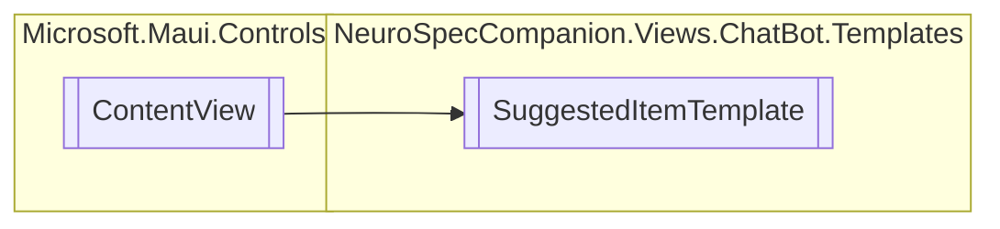

# SuggestedItemTemplate `Public class`

## Diagram


## Details
### Inheritance
 - `ContentView`

### Constructors
#### SuggestedItemTemplate
```csharp
public SuggestedItemTemplate()
```

*Generated with* [*ModularDoc*](https://github.com/hailstorm75/ModularDoc)
