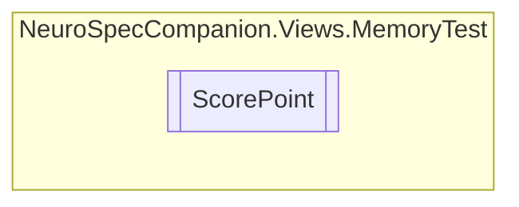

# ScorePoint `Internal class`

## Diagram


## Members
### Properties
#### Public  properties
| Type | Name | Methods |
| --- | --- | --- |
| `bool` | [`correct`](#correct) | `get, set` |
| `DateTime` | [`timeStamp`](#timestamp) | `get, set` |

## Details
### Constructors
#### ScorePoint
```csharp
public ScorePoint(DateTime time, Coordinates c, bool correct)
```
##### Arguments
| Type | Name | Description |
| --- | --- | --- |
| `DateTime` | time |   |
| [`Coordinates`](./neurospeccompanionviewsmemorytest-Coordinates) | c |   |
| `bool` | correct |   |

### Properties
#### timeStamp
```csharp
public DateTime timeStamp { get; set; }
```

#### correct
```csharp
public bool correct { get; set; }
```

*Generated with* [*ModularDoc*](https://github.com/hailstorm75/ModularDoc)
