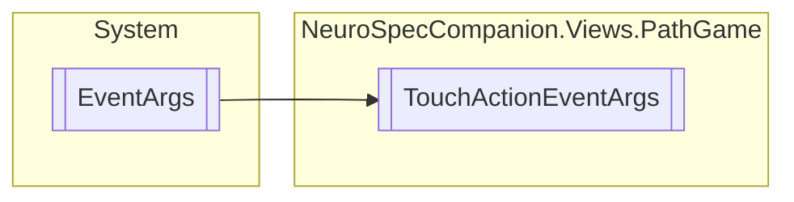

# TouchActionEventArgs `Public class`

## Diagram


## Members
### Properties
#### Public  properties
| Type | Name | Methods |
| --- | --- | --- |
| `long` | [`Id`](#id) | `get, private set` |
| `bool` | [`IsInContact`](#isincontact) | `get, private set` |
| `Point` | [`Location`](#location) | `get, private set` |
| `TouchActionType` | [`Type`](#type) | `get, private set` |

## Details
### Inheritance
 - `EventArgs`

### Constructors
#### TouchActionEventArgs
```csharp
public TouchActionEventArgs(long id, TouchActionType type, Point location, bool isInContact)
```
##### Arguments
| Type | Name | Description |
| --- | --- | --- |
| `long` | id |   |
| `TouchActionType` | type |   |
| `Point` | location |   |
| `bool` | isInContact |   |

### Properties
#### Id
```csharp
public long Id { get; private set; }
```

#### Type
```csharp
public TouchActionType Type { get; private set; }
```

#### Location
```csharp
public Point Location { get; private set; }
```

#### IsInContact
```csharp
public bool IsInContact { get; private set; }
```

*Generated with* [*ModularDoc*](https://github.com/hailstorm75/ModularDoc)
