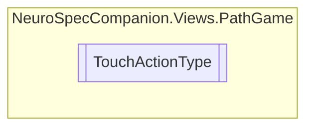

# TouchActionType `Public enum`

## Diagram

## Details
### Fields
#### Entered

#### Pressed

#### Moved

#### Released

#### Exited

#### Cancelled

*Generated with* [*ModularDoc*](https://github.com/hailstorm75/ModularDoc)
