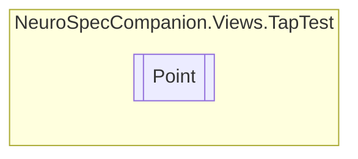

# Point `Internal class`

## Diagram


## Members
### Properties
#### Public  properties
| Type | Name | Methods |
| --- | --- | --- |
| `bool` | [`Correct`](#correct) | `get, set` |
| `int` | [`X`](#x) | `get, set` |
| `int` | [`Y`](#y) | `get, set` |

## Details
### Constructors
#### Point
```csharp
public Point(int x, int y)
```
##### Arguments
| Type | Name | Description |
| --- | --- | --- |
| `int` | x |   |
| `int` | y |   |

### Properties
#### X
```csharp
public int X { get; set; }
```

#### Y
```csharp
public int Y { get; set; }
```

#### Correct
```csharp
public bool Correct { get; set; }
```

*Generated with* [*ModularDoc*](https://github.com/hailstorm75/ModularDoc)
