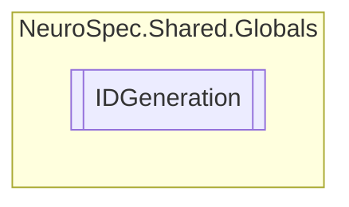

# IDGeneration `Public class`

## Diagram


## Members
### Methods
#### Public Static methods
| Returns | Name |
| --- | --- |
| `DateTime` | [`CalculateBirthdate`](#calculatebirthdate)(`int` age) |
| `string` | [`generateNewAdminID`](#generatenewadminid)() |
| `int` | [`generateNewAttendanceRecordID`](#generatenewattendancerecordid)(`int` userID) |
| `int` | [`generateNewCalendarEventID`](#generatenewcalendareventid)(`int` userID) |
| `int` | [`generateNewChatMessageID`](#generatenewchatmessageid)(`int` senderID) |
| `int` | [`generateNewChatRoomID`](#generatenewchatroomid)(`int` fID, `int` sID) |
| `int` | [`generateNewDoctorID`](#generatenewdoctorid)(`string` nid) |
| `int` | [`generateNewEmployeeID`](#generatenewemployeeid)(`string` nid) |
| `int` | [`generateNewExerciseID`](#generatenewexerciseid)() |
| `int` | [`generateNewIssueExerciseID`](#generatenewissueexerciseid)(`int` prescriptionID, `int` patientID) |
| `int` | [`generateNewPatientID`](#generatenewpatientid)(`string` phoneNumber) |
| `int` | [`generateNewPaymentID`](#generatenewpaymentid)(`int` patID, `DateTime` time) |
| `int` | [`generateNewPrescriptionID`](#generatenewprescriptionid)(`int` visitID, `DateTime` time) |
| `int` | [`generateNewRecordID`](#generatenewrecordid)(`int` patientID) |
| `int` | [`generateNewTestFeedBackID`](#generatenewtestfeedbackid)(`int` visitID, `int` patientID) |
| `int` | [`generateNewVisitID`](#generatenewvisitid)(`int` patID, `DateTime` time) |

## Details
### Methods
#### generateNewPatientID
```csharp
public static int generateNewPatientID(string phoneNumber)
```
##### Arguments
| Type | Name | Description |
| --- | --- | --- |
| `string` | phoneNumber |   |

#### CalculateBirthdate
```csharp
public static DateTime CalculateBirthdate(int age)
```
##### Arguments
| Type | Name | Description |
| --- | --- | --- |
| `int` | age |   |

#### generateNewRecordID
```csharp
public static int generateNewRecordID(int patientID)
```
##### Arguments
| Type | Name | Description |
| --- | --- | --- |
| `int` | patientID |   |

#### generateNewAttendanceRecordID
```csharp
public static int generateNewAttendanceRecordID(int userID)
```
##### Arguments
| Type | Name | Description |
| --- | --- | --- |
| `int` | userID |   |

#### generateNewCalendarEventID
```csharp
public static int generateNewCalendarEventID(int userID)
```
##### Arguments
| Type | Name | Description |
| --- | --- | --- |
| `int` | userID |   |

#### generateNewDoctorID
```csharp
public static int generateNewDoctorID(string nid)
```
##### Arguments
| Type | Name | Description |
| --- | --- | --- |
| `string` | nid |   |

#### generateNewEmployeeID
```csharp
public static int generateNewEmployeeID(string nid)
```
##### Arguments
| Type | Name | Description |
| --- | --- | --- |
| `string` | nid |   |

#### generateNewAdminID
```csharp
public static string generateNewAdminID()
```

#### generateNewVisitID
```csharp
public static int generateNewVisitID(int patID, DateTime time)
```
##### Arguments
| Type | Name | Description |
| --- | --- | --- |
| `int` | patID |   |
| `DateTime` | time |   |

#### generateNewPaymentID
```csharp
public static int generateNewPaymentID(int patID, DateTime time)
```
##### Arguments
| Type | Name | Description |
| --- | --- | --- |
| `int` | patID |   |
| `DateTime` | time |   |

#### generateNewPrescriptionID
```csharp
public static int generateNewPrescriptionID(int visitID, DateTime time)
```
##### Arguments
| Type | Name | Description |
| --- | --- | --- |
| `int` | visitID |   |
| `DateTime` | time |   |

#### generateNewIssueExerciseID
```csharp
public static int generateNewIssueExerciseID(int prescriptionID, int patientID)
```
##### Arguments
| Type | Name | Description |
| --- | --- | --- |
| `int` | prescriptionID |   |
| `int` | patientID |   |

#### generateNewTestFeedBackID
```csharp
public static int generateNewTestFeedBackID(int visitID, int patientID)
```
##### Arguments
| Type | Name | Description |
| --- | --- | --- |
| `int` | visitID |   |
| `int` | patientID |   |

#### generateNewExerciseID
```csharp
public static int generateNewExerciseID()
```

#### generateNewChatRoomID
```csharp
public static int generateNewChatRoomID(int fID, int sID)
```
##### Arguments
| Type | Name | Description |
| --- | --- | --- |
| `int` | fID |   |
| `int` | sID |   |

#### generateNewChatMessageID
```csharp
public static int generateNewChatMessageID(int senderID)
```
##### Arguments
| Type | Name | Description |
| --- | --- | --- |
| `int` | senderID |   |

*Generated with* [*ModularDoc*](https://github.com/hailstorm75/ModularDoc)
