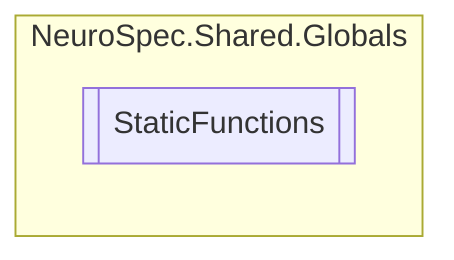

# StaticFunctions `Public class`

## Diagram


## Members
### Methods
#### Public Static methods
| Returns | Name |
| --- | --- |
| `int` | [`CalculateAge`](#calculateage)(`DateTime` birthDate) |
| `DateTime` | [`CalculateBirthdate`](#calculatebirthdate)(`int` age) |

## Details
### Methods
#### CalculateAge
```csharp
public static int CalculateAge(DateTime birthDate)
```
##### Arguments
| Type | Name | Description |
| --- | --- | --- |
| `DateTime` | birthDate |   |

#### CalculateBirthdate
```csharp
public static DateTime CalculateBirthdate(int age)
```
##### Arguments
| Type | Name | Description |
| --- | --- | --- |
| `int` | age |   |

*Generated with* [*ModularDoc*](https://github.com/hailstorm75/ModularDoc)
