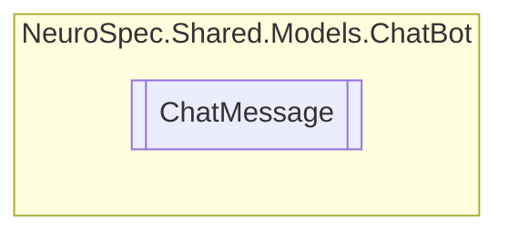

# ChatMessage `Public class`

## Diagram


## Members
### Properties
#### Public  properties
| Type | Name | Methods |
| --- | --- | --- |
| `string` | [`Text`](#text) | `get, set` |

## Details
### Constructors
#### ChatMessage
```csharp
public ChatMessage()
```

### Properties
#### Text
```csharp
public string Text { get; set; }
```

*Generated with* [*ModularDoc*](https://github.com/hailstorm75/ModularDoc)
