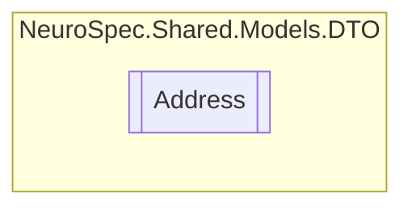

# Address `Public class`

## Diagram


## Members
### Properties
#### Public  properties
| Type | Name | Methods |
| --- | --- | --- |
| `string` | [`City`](#city) | `get, set` |
| `string` | [`Country`](#country) | `get, set` |
| `string` | [`State`](#state) | `get, set` |
| `string` | [`Street`](#street) | `get, set` |
| `string` | [`ZipCode`](#zipcode) | `get, set` |

## Details
### Constructors
#### Address
```csharp
public Address()
```

### Properties
#### Street
```csharp
public string Street { get; set; }
```

#### City
```csharp
public string City { get; set; }
```

#### State
```csharp
public string State { get; set; }
```

#### ZipCode
```csharp
public string ZipCode { get; set; }
```

#### Country
```csharp
public string Country { get; set; }
```

*Generated with* [*ModularDoc*](https://github.com/hailstorm75/ModularDoc)
