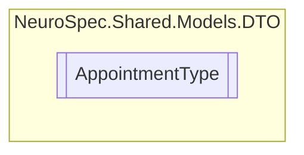

# AppointmentType `Public class`

## Diagram


## Members
### Properties
#### Public  properties
| Type | Name | Methods |
| --- | --- | --- |
| `double` | [`Cost`](#cost) | `get, set` |
| `string` | [`Description`](#description) | `get, set` |
| `string` | [`Id`](#id) | `get, set` |
| `string` | [`Name`](#name) | `get, set` |
| `int` | [`TimeInMinutes`](#timeinminutes) | `get, set` |
| `int` | [`TypeID`](#typeid) | `get, set` |

### Methods
#### Public  methods
| Returns | Name |
| --- | --- |
| `string` | [`ToString`](#tostring)() |

## Details
### Constructors
#### AppointmentType
```csharp
public AppointmentType()
```

### Methods
#### ToString
```csharp
public override string ToString()
```

### Properties
#### Id
```csharp
public string Id { get; set; }
```

#### TypeID
```csharp
public int TypeID { get; set; }
```

#### Name
```csharp
public string Name { get; set; }
```

#### Description
```csharp
public string Description { get; set; }
```

#### TimeInMinutes
```csharp
public int TimeInMinutes { get; set; }
```

#### Cost
```csharp
public double Cost { get; set; }
```

*Generated with* [*ModularDoc*](https://github.com/hailstorm75/ModularDoc)
