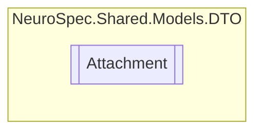

# Attachment `Public class`

## Diagram


## Members
### Properties
#### Public  properties
| Type | Name | Methods |
| --- | --- | --- |
| `string` | [`contentType`](#contenttype) | `get, set` |
| `string` | [`title`](#title) | `get, set` |
| `string` | [`url`](#url) | `get, set` |

## Details
### Constructors
#### Attachment
```csharp
public Attachment()
```

### Properties
#### url
```csharp
public string url { get; set; }
```

#### title
```csharp
public string title { get; set; }
```

#### contentType
```csharp
public string contentType { get; set; }
```

*Generated with* [*ModularDoc*](https://github.com/hailstorm75/ModularDoc)
