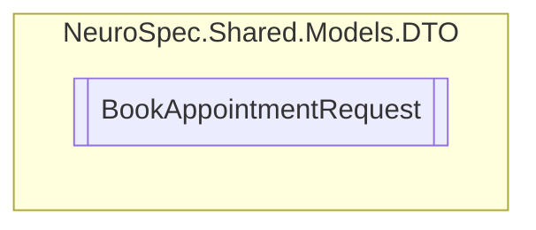

# BookAppointmentRequest `Public class`

## Diagram


## Members
### Properties
#### Public  properties
| Type | Name | Methods |
| --- | --- | --- |
| `DateTime` | [`AppointmentTime`](#appointmenttime) | `get, set` |
| `int` | [`AppointmentTypeID`](#appointmenttypeid) | `get, set` |
| `int` | [`BookAppointmentRequestID`](#bookappointmentrequestid) | `get, set` |
| `int` | [`DoctorID`](#doctorid) | `get, set` |
| `string` | [`Id`](#id) | `get, set` |
| `bool` | [`IsConfirmed`](#isconfirmed) | `get, set` |
| `bool` | [`IsUrgent`](#isurgent) | `get, set` |
| `int` | [`PatientID`](#patientid) | `get, set` |
| `string` | [`Reason`](#reason) | `get, set` |

## Details
### Constructors
#### BookAppointmentRequest
```csharp
public BookAppointmentRequest()
```

### Properties
#### Id
```csharp
public string Id { get; set; }
```

#### BookAppointmentRequestID
```csharp
public int BookAppointmentRequestID { get; set; }
```

#### PatientID
```csharp
public int PatientID { get; set; }
```

#### DoctorID
```csharp
public int DoctorID { get; set; }
```

#### AppointmentTypeID
```csharp
public int AppointmentTypeID { get; set; }
```

#### AppointmentTime
```csharp
public DateTime AppointmentTime { get; set; }
```

#### Reason
```csharp
public string Reason { get; set; }
```

#### IsUrgent
```csharp
public bool IsUrgent { get; set; }
```

#### IsConfirmed
```csharp
public bool IsConfirmed { get; set; }
```

*Generated with* [*ModularDoc*](https://github.com/hailstorm75/ModularDoc)
