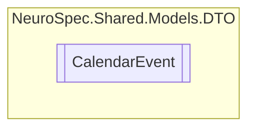

# CalendarEvent `Public class`

## Diagram


## Members
### Properties
#### Public  properties
| Type | Name | Methods |
| --- | --- | --- |
| `DateTime` | [`EventEndTime`](#eventendtime) | `get, set` |
| `int` | [`EventID`](#eventid) | `get, set` |
| `string` | [`EventName`](#eventname) | `get, set` |
| `DateTime` | [`EventStartTime`](#eventstarttime) | `get, set` |
| `string` | [`EventText`](#eventtext) | `get, set` |
| `string` | [`Id`](#id) | `get, set` |
| `bool` | [`IsDone`](#isdone) | `get, set` |
| `int` | [`UserID`](#userid) | `get, set` |

## Details
### Constructors
#### CalendarEvent
```csharp
public CalendarEvent()
```

### Properties
#### Id
```csharp
public string Id { get; set; }
```

#### EventID
```csharp
public int EventID { get; set; }
```

#### UserID
```csharp
public int UserID { get; set; }
```

#### EventName
```csharp
public string EventName { get; set; }
```

#### EventText
```csharp
public string EventText { get; set; }
```

#### EventStartTime
```csharp
public DateTime EventStartTime { get; set; }
```

#### EventEndTime
```csharp
public DateTime EventEndTime { get; set; }
```

#### IsDone
```csharp
public bool IsDone { get; set; }
```

*Generated with* [*ModularDoc*](https://github.com/hailstorm75/ModularDoc)
