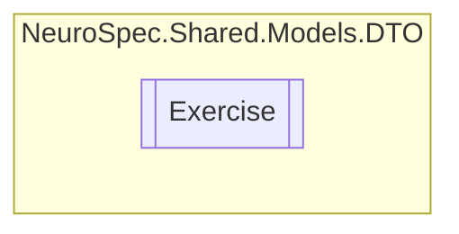

# Exercise `Public class`

## Diagram


## Members
### Properties
#### Public  properties
| Type | Name | Methods |
| --- | --- | --- |
| `string` | [`ExerciseCategory`](#exercisecategory) | `get, set` |
| `string` | [`ExerciseDescription`](#exercisedescription) | `get, set` |
| `string` | [`ExerciseDuration`](#exerciseduration) | `get, set` |
| `string` | [`ExerciseEquipment`](#exerciseequipment) | `get, set` |
| `string` | [`ExerciseFrequency`](#exercisefrequency) | `get, set` |
| `int` | [`ExerciseID`](#exerciseid) | `get, set` |
| `string` | [`ExerciseImage`](#exerciseimage) | `get, set` |
| `string` | [`ExerciseInstructions`](#exerciseinstructions) | `get, set` |
| `string` | [`ExerciseIntensity`](#exerciseintensity) | `get, set` |
| `string` | [`ExerciseName`](#exercisename) | `get, set` |
| `string` | [`ExerciseType`](#exercisetype) | `get, set` |

## Details
### Constructors
#### Exercise
```csharp
public Exercise()
```

### Properties
#### ExerciseID
```csharp
public int ExerciseID { get; set; }
```

#### ExerciseName
```csharp
public string ExerciseName { get; set; }
```

#### ExerciseType
```csharp
public string ExerciseType { get; set; }
```

#### ExerciseCategory
```csharp
public string ExerciseCategory { get; set; }
```

#### ExerciseDescription
```csharp
public string ExerciseDescription { get; set; }
```

#### ExerciseDuration
```csharp
public string ExerciseDuration { get; set; }
```

#### ExerciseFrequency
```csharp
public string ExerciseFrequency { get; set; }
```

#### ExerciseIntensity
```csharp
public string ExerciseIntensity { get; set; }
```

#### ExerciseEquipment
```csharp
public string ExerciseEquipment { get; set; }
```

#### ExerciseInstructions
```csharp
public string ExerciseInstructions { get; set; }
```

#### ExerciseImage
```csharp
public string ExerciseImage { get; set; }
```

*Generated with* [*ModularDoc*](https://github.com/hailstorm75/ModularDoc)
