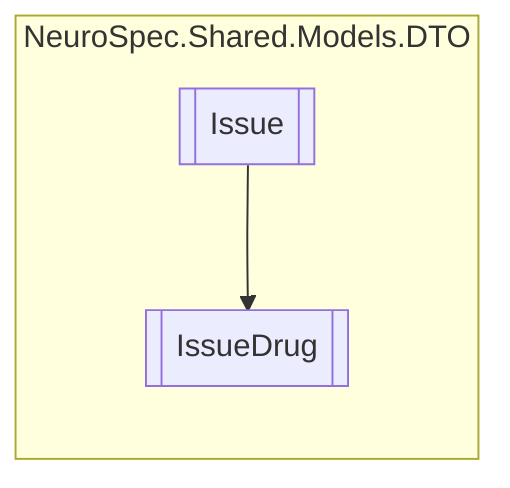

# IssueDrug `Public class`

## Diagram


## Members
### Properties
#### Public  properties
| Type | Name | Methods |
| --- | --- | --- |
| `string` | [`Name`](#name) | `get, set` |
| `string` | [`URL`](#url) | `get, set` |

## Details
### Inheritance
 - [
`Issue`
](./neurospecsharedmodelsdto-Issue)

### Constructors
#### IssueDrug
```csharp
public IssueDrug()
```

### Properties
#### Name
```csharp
public string Name { get; set; }
```

#### URL
```csharp
public string URL { get; set; }
```

*Generated with* [*ModularDoc*](https://github.com/hailstorm75/ModularDoc)
