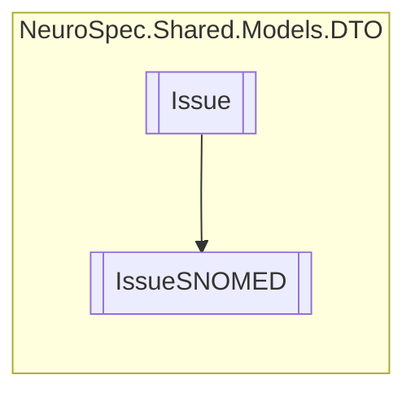

# IssueSNOMED `Public class`

## Diagram


## Members
### Properties
#### Public  properties
| Type | Name | Methods |
| --- | --- | --- |
| `string` | [`SNOMEDDescription`](#snomeddescription) | `get, set` |
| `string` | [`SNOMEDID`](#snomedid) | `get, set` |
| `string` | [`SNOMEDName`](#snomedname) | `get, set` |

## Details
### Inheritance
 - [
`Issue`
](./neurospecsharedmodelsdto-Issue)

### Constructors
#### IssueSNOMED
```csharp
public IssueSNOMED()
```

### Properties
#### SNOMEDID
```csharp
public string SNOMEDID { get; set; }
```

#### SNOMEDName
```csharp
public string SNOMEDName { get; set; }
```

#### SNOMEDDescription
```csharp
public string SNOMEDDescription { get; set; }
```

*Generated with* [*ModularDoc*](https://github.com/hailstorm75/ModularDoc)
